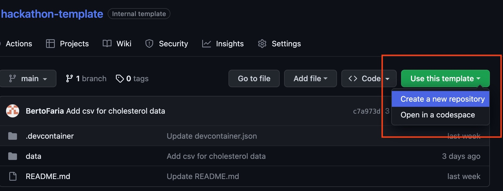
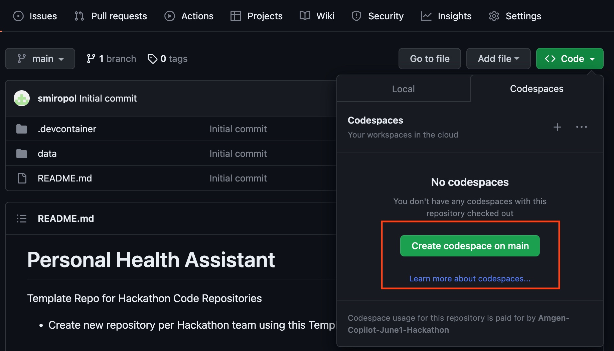
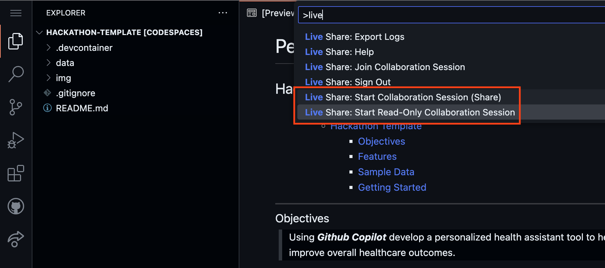

# Personal Health Assistant

## Hackathon Template

- [Personal Health Assistant](#personal-health-assistant)
  - [Hackathon Template](#hackathon-template)
    - [Objectives](#objectives)
    - [Features](#features)
    - [Sample Data](#sample-data)
    - [Getting Started](#getting-started)
    - [GitHub Copilot](#github-copilot)
    - [Resources](#resources)

-----------------

### Objectives<a name="objectives"></a>

> Using ***Github Copilot*** develop a personalized health assistant tool to help patients manage their medication regimen, collect patient feedback, and improve overall healthcare outcomes.

-----------------

### Features<a name="features"></a>
> Select one or more features for your Hackathon project from the list below:

- ***Medication Management***
  - Provide medication reminders, dosage tracking, and drug interaction warnings for `<Drug>`.
- ***Lifestyle Recommendations***
  - Offer personalized diet, exercise, and stress management suggestions based on patient profiles and medical history.
- ***Side Effect Monitoring***
  - Enable patients to report and track adverse events related to `<Drug>`.
- ***Patient Feedback Collection***
  - Collect anonymized patient feedback on efficacy, ease of use, and overall satisfaction with `<Drug>`
- ***Patient Experience Analysis***
  - Analyze patient feedback using machine learning to identify trends and areas for improvement.
- ***Feedback-Driven Improvements***
  - Share insights from patient feedback with healthcare providers to optimize treatment plans and improve patient outcomes.

-----------------

### Sample Data<a name="sample-data"></a>

- ***Anonymized patient data***
  - Demographics, medical history, and `<Drug>` treatment information. [```data/patient_data.csv```]
- ***Electronic Health Records (EHRs)***
  - Anonymized patient medical histories, diagnoses, prescriptions, and laboratory results related to cholesterol management and cardiovascular health. [```data/cholesterol_info.csv```]
- ***Nutrition and exercise data:*** [```data/food_database.xlsx```]
  - Information on food items, exercises, and relevant health guidelines for patients with high cholesterol.
- ***Patient feedback data:*** [```data/feedback.csv```]
  - Anonymized text data from patient feedback forms, surveys, or online reviews related to their experience with `<Drug>`.

> Use provided data or generate sample data using e.g. [Mockaroo](https://mockaroo.com/)

### Getting Started<a name="getting-started"></a>

1. Name your `<Team>`
2. Name your `<Drug>`
3. [Create a new repository **for your TEAM** from this template<a name="create-new-repo"></a>](https://docs.github.com/en/repositories/creating-and-managing-repositories/creating-a-repository-from-a-template)
> Name your Github Repository as `<Team>`

1. [Create a CodeSpace<a name="create-codespace"></a>](https://docs.github.com/en/codespaces/developing-in-codespaces/creating-a-codespace)
    > by using CodeSpaces you don't need to clone the code or install IDE extensions locally*

1. You may use [Live Share VS Code extension](https://code.visualstudio.com/learn/collaboration/live-share) to collaborate with your team members in the same CodeSpace


### GitHub Copilot<a name="github-copilot"></a>
- [Keyboard Shortcuts](https://docs.github.com/en/copilot/configuring-github-copilot/configuring-github-copilot-in-your-environment?tool=vscode#keyboard-shortcuts-for-macos-1)
- [Best Practices for Beginners](https://dev.to/github/a-beginners-guide-to-prompt-engineering-with-github-copilot-3ibp)

### Resources<a name="resources"></a>
- [Node.js Hackathon Starter Kit](https://github.com/sahat/hackathon-starter)
- [Python Flask Hackathon Starter Kit](https://github.com/MLH/mlh-hackathon-flask-starter#installation-guide)
